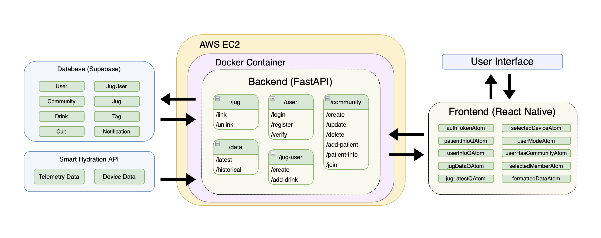

# Smart Hydration App: A hydration monitoring app for carers and standard users (University of Bristol Final Project)

Smart Hydration: a React Native application for iOS / Android. 

This app is designed to be a hydration monitoring app for carers and the general public. To build this app, it is recommended that you install the following:

* xCode / Android Studio
* Python 3.10

## Getting Started

### React Native setup

1. Install yarn

On Mac:

```
brew install yarn
```

For Windows and Linux, see [here](https://classic.yarnpkg.com/lang/en/docs/install/#mac-stable).


2. Install dependencies

```
cd smart-hydration-app
yarn
```

3. Start dev server with

```
yarn start
```


### Server/Backend setup

1. Create a virtual environment (venv)

```
cd server
python3 -m venv .venv
```

2. Install dependencies

```
source .venv/bin/activate
pip install -r requirements.txt
```

3. Update `.env` file

Please contact us for these, or you can [add your own](#using-your-own-infrastructure).


3. Run the dev server with the makefile

```
cd server
make dev
```


4. If using an Android simulator:

Make sure the TCP port of the Android simulator is the same as displayed when running `make dev` by running:
```
adb reverse --list
```
If the ports are different, you can change the Android TCP port as follows:
```
adb reverse tcp:[FastAPI port] tcp:[FastAPI port]
```

### Architecture Diagram



### Walkthrough video

[Walkthrough Video](https://www.youtube.com/watch?v=Z6E3xgtG2q4)

### Using your own infrastructure

You can run this project by using your own database and API keys. You will require the following `.env` variables:

Database environment: we used Supabase for this.
* `PROD_DB_USERNAME`
* `PROD_DB_PASSWORD`
* `PROD_DB_HOST`
* `STAGING_DB_USERNAME`
* `STAGING_DB_PASSWORD`
* `STAGING_DB_HOST`

Smart Hydration login: please contact Smart Hydration for this:
* `SMART_HYDRATION_EMAIL`
* `SMART_HYDRATION_PASSWORD`

JWT Tokens + algorithm: you can generate these in python:
* `JWT_SECRET`
* `JWT_ALGORITHM`

* `TESTING_USER_ID`: you can create a dedicated test account and get the accounts UUID from the database:
* `USE_PRODUCTION_DB`: Toggle this depending on which database you would like to use.

Pusher environment; please contact Smart Hydration for this:
* `PUSHER_APP_KEY`
* `PUSHER_APP_SECRET`
* `PUSHER_APP_CLUSTER`

Email API environment:
* `SES_USER_ID`
* `SES_PASSWORD`
* `SES_HOST_ADDRESS`

### Building for iOS

It's best to do this in XCode. You will need to add the following capabilities:
* Access Wi-Fi Information
* Hotspot
* Push Notifications

You will also need to add the following your `info.plist` file:
```
<key>NSLocationAlwaysAndWhenInUseUsageDescription</key>
<string>Always and in usage permissions for Location</string>
<key>NSLocationWhenInUseUsageDescription</key>
<string>Location when in use</string>
```

### Building for Android

Before building the app, you will need to follow this [guide](https://docs.expo.dev/push-notifications/fcm-credentials/) to configure FCM credentials for the app. 

Then install android studio and use it to install the Android SDK. Add the Android SDK to your path as `$ANDROID_HOME`.

Before building the app, you will need to remove `google-services.json` from your `.gitignore`, otherwise eas won’t be able to find it. Make sure to add it back in after building, as this contains sensitive information which should not be pushed to your remote repository.

Then run `yarn expo prebuild --platform android` to prebuild the android folder for the app.

To build a local .apk file, run `eas build –-platform android –-local`. Wait for the build process to complete and then install the app on the android device of your choosing.

